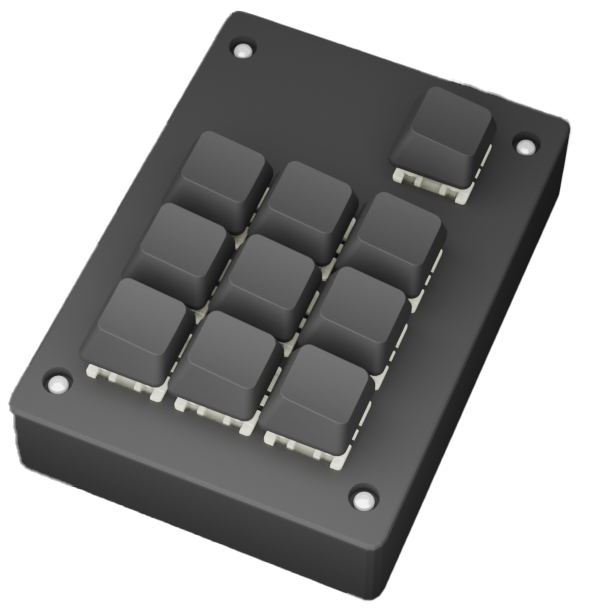
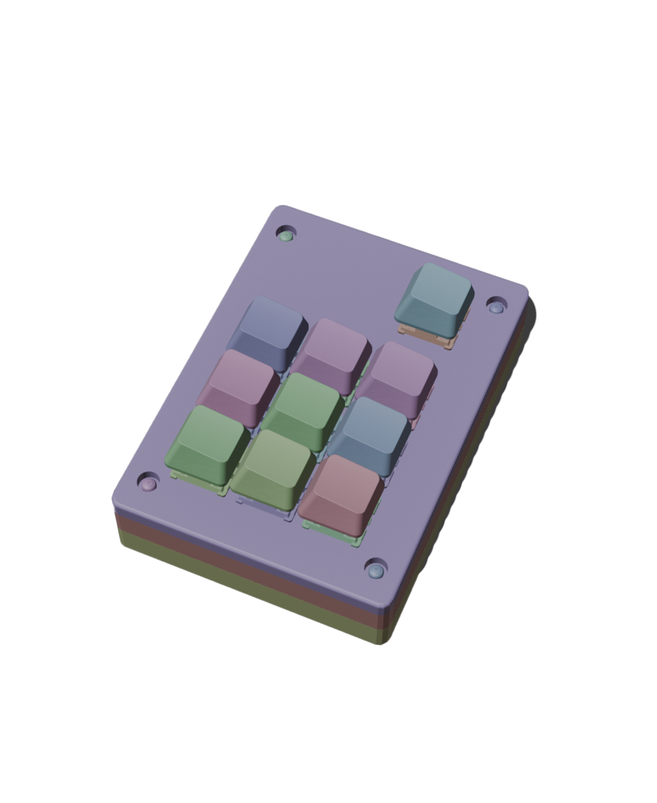

# StorageBuddy macropad configurator

Tento program je vytvořen pro macropad který vyvíjím 

## How to install

1.  **Download the installer:**
    * Click [here](link_na_vas_exe_soubor) to download the installer (StorageBuddy-Installer.exe).
2.  **Run the installer:**
    * Locate the downloaded `StorageBuddy-Installer.exe` file.
    * Double-click the file to start the installation process.
    * Follow the on-screen instructions to complete the installation.
3.  **Connect the Macropad:**
    * Connect your macropad to your computer using a USB cable.
4.  **Run the application:**
    * Once the installation is complete, run the application "StorageBuddy" from your desktop or start menu.
5.  **Configure the macropad:**
    * Open the application and configure the keys to your liking.

## git clone

1. Naklonujte repozitár:
   ```bash
   git clone https://github.com/martinsram3k/macropad_configurator

# Project Overview

This project consists of three main components that work together to create a configurable macropad:

1.  **Frontend (HTML, CSS, JavaScript):** Provides a user interface for configuring macropad key functions.
2.  **Backend (Python Flask):** Serves as a bridge between the frontend and the macropad, receiving configurations and forwarding them.
3.  **Firmware (CircuitPython):** Runs on the macropad, processing configurations and executing key functions.

## How it Works

### Frontend (HTML, CSS, JavaScript)

* **HTML:**
    * Defines the structure of the web page, including the menu, macropad key display, layer selection controls, and a text area for entering key functions.
    * Uses `data-key` attributes to identify individual keys and layers.
* **CSS:**
    * Styles the web page, defining the appearance of the menu, keys, buttons, and other elements.
    * Creates a responsive design.
* **JavaScript (script.js):**
    * Handles user interactions.
    * Allows switching between macropad layers using buttons and layer indicators (dots).
    * Enables key selection and displays a text area for entering key functions.
    * Sends key configurations (key number, layer, function) to the backend using the `fetch` API.
    * Displays a confirmation message when data is successfully received from the server.

### Backend (Python Flask)

* **server.py:**
    * Uses Flask to create a web server.
    * Uses Flask-CORS to enable Cross-Origin Resource Sharing (CORS), allowing the frontend to communicate with the backend.
    * Initializes the serial port (COM6) for communication with the macropad.
    * Defines the `/receivedata` endpoint, which receives POST requests with key configurations from the frontend.
    * Currently the recived data is not send to the serial port.
    * processes the recived data (key number, layer, function)

### Firmware (CircuitPython)

* **Macropad Code:**
    * Initializes pins for the key matrix rows and columns.
    * Initializes the serial port for communication with the backend.
    * Initializes the keyboard for emulating key presses.
    * Defines a mapping of keys to functions (`key_map`).
    * The `process_serial_data()` function receives key configurations from the backend and updates the key mapping.
    * The `execute_function()` function executes the function associated with a given key (emulates key presses).
    * The `read_keys()` function reads key presses from the key matrix and calls `execute_function()`.
    * The main loop continuously reads data from the serial port and checks for key presses.

### Interaction Between Components

1.  The user configures keys on the frontend web page.
2.  The frontend sends the key configuration to the backend via an HTTP POST request.
3.  The backend receives the configuration and sends it to the serial port.
4.  The firmware on the macropad receives the configuration from the serial port and updates the key mapping.
5.  The user presses a key on the macropad.
6.  The firmware detects the key press and executes the corresponding function (emulates key presses).

### Key Points

* Communication between the frontend and backend occurs via HTTP and JSON.
* Communication between the backend and macropad occurs via the serial port.
* The macropad firmware uses CircuitPython and the `adafruit_hid` library for emulating key presses.
* The python backend code, does not yet send the data to the macropad.

## Galerie fotografií

<div style="display: flex; flex-wrap: wrap; gap: 10px; margin-right: auto; margin-left:auto;">
    
    
    
</div>

## Macropad Description

This custom-designed macropad is a versatile tool designed to enhance productivity and streamline workflows. Here's a breakdown of its key features:

* **Microcontroller:** Powered by the robust KB2040 microcontroller, ensuring reliable performance and ample processing power.
* **Case:** The macropad's enclosure is 3D-printed using durable PLA filament, providing a sturdy and customizable form factor.
* **PCB:** Features a custom-designed printed circuit board (PCB), meticulously crafted for optimal functionality and efficiency.
* **Keys:** Equipped with 9 programmable keys, allowing for a wide range of custom functions and macros.
* **Layer Key:** Includes a dedicated 10th key for seamless layer switching, enabling access to up to 3 distinct layers of programmable functions.
* **Layers:** The macropad supports 3 programmable layers, effectively tripling the number of available custom functions.
* **Multimedia control:** The macropad can be configured to control multimedia functions, such as volume adjustment, play/pause, and stop.
* **Quick access:** The macropad can be configured to open applications, like calculator.

This macropad is ideal for professionals and enthusiasts who frequently use complex keyboard shortcuts and seek to enhance their workflow efficiency. Specifically, it caters to:

* **Photographers:** Streamline photo editing processes with quick access to commonly used tools and adjustments.
* **Video Editors:** Accelerate video editing tasks by assigning intricate editing commands to easily accessible keys.
* **Graphic Designers:** Simplify design workflows with one-touch access to frequently used design software functions.
* **Anyone needing complex keyboard shortcuts:** In general, anyone who wants to speed up computer work.
* **People who want to control multimedia:** Easy multimedia control.
* **People who want to have quick access to applications:** Quick access to applications like calculator.

Essentially, this macropad is designed for anyone looking to boost productivity and minimize repetitive keystrokes, ultimately leading to a more efficient and enjoyable computing experience.
   
## Support the Project

If you find this project helpful and would like to support its development, you can do so through the following platforms:

* **Buy Me a Coffee:** [Buy Me a Coffee Link](https://buymeacoffee.com/martin.sram3k)
* **PayPal.me:** [PayPal.me Link](https://paypal.me/marti842?country.x=CZ&locale.x=cs_CZ)

Your support is greatly appreciated and helps to keep this project alive and growing!