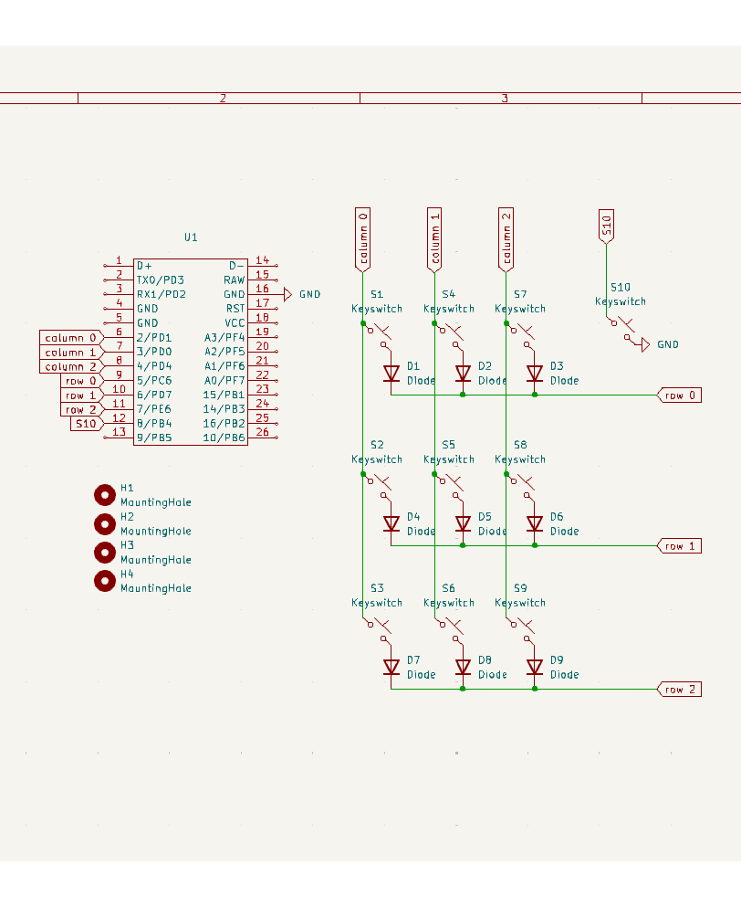
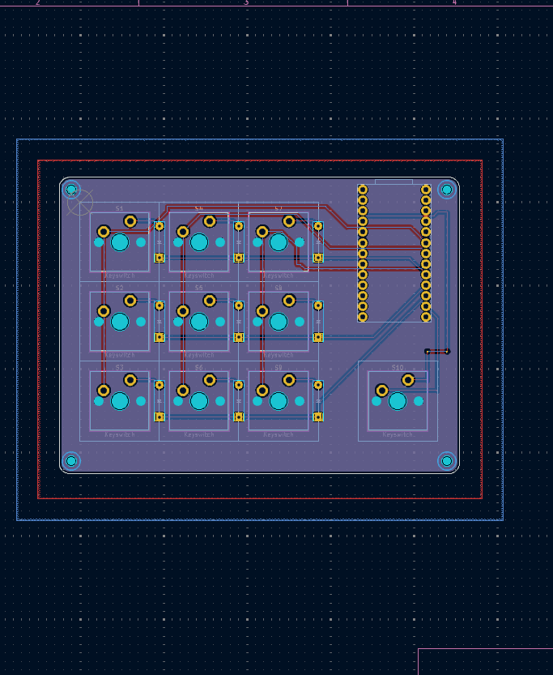

# ⚙️ StorageBuddy Macropad Configurator ⌨️

This program is created for a macropad I am developing. 🛠️

## ⬇️ How to Install 

###  Windows Installation

1.  **Download the installer:**
    * Click [here](link_na_vas_exe_soubor) to download the installer (StorageBuddy-Installer.exe). 
2.  **Run the installer:**
    * Locate the downloaded `StorageBuddy-Installer.exe` file. 
    * Double-click the file to start the installation process. ️
    * Follow the on-screen instructions to complete the installation. ️
3.  **Connect the Macropad:**
    * Connect your macropad to your computer using a USB cable. 
4.  **Run the application:**
    * Once the installation is complete, run the application "StorageBuddy" from your desktop or start menu. 
5.  **Configure the macropad:**
    * Open the application and configure the keys to your liking. ⚙️

###  macOS Installation

1.  **Download the application package:**
    * Click [here](link_na_vas_dmg_soubor) to download the application package (StorageBuddy.dmg). 
2.  **Mount the DMG file:**
    * Locate the downloaded `StorageBuddy.dmg` file. 
    * Double-click the file to mount it. ️
3.  **Copy the application:**
    * Drag and drop the "StorageBuddy" application to your "Applications" folder. 
4.  **Connect the Macropad:**
    * Connect your macropad to your computer using a USB cable. 
5.  **Run the application:**
    * Open the "Applications" folder and double-click "StorageBuddy" to run it. 
6.  **Configure the macropad:**
    * Open the application and configure the keys to your liking. ⚙️

## 💻 Git Clone 🐙

1.  Clone the repository:
    ```bash
    git clone [https://github.com/martinsram3k/macropad_configurator](https://github.com/martinsram3k/macropad_configurator)
    ```

# 🚀 Project Overview 🌐

This project consists of three main components that work together to create a configurable macropad:

1.  **Frontend (HTML, CSS, JavaScript):** Provides a user interface for configuring macropad key functions. 🎨
2.  **Backend (Python Flask):** Serves as a bridge between the frontend and the macropad, receiving configurations and forwarding them. 🌉
3.  **Firmware (CircuitPython):** Runs on the macropad, processing configurations and executing key functions. 🧠

## ⚙️ How it Works 🛠️

### 🌐 Frontend (HTML, CSS, JavaScript) 🎨

* **HTML:**
    * Defines the structure of the web page, including the menu, macropad key display, layer selection controls, and a text area for entering key functions. 📄
    * Uses `data-key` attributes to identify individual keys and layers. 🏷️
* **CSS:**
    * Styles the web page, defining the appearance of the menu, keys, buttons, and other elements. 🖌️
    * Creates a responsive design. 📱
* **JavaScript (script.js):**
    * Handles user interactions. 🖱️
    * Allows switching between macropad layers using buttons and layer indicators (dots). 🔘
    * Enables key selection and displays a text area for entering key functions. 📝
    * Sends key configurations (key number, layer, function) to the backend using the `fetch` API. 📡
    * Displays a confirmation message when data is successfully received from the server. ✅

### 🐍 Backend (Python Flask) 🖥️

* **server.py:**
    * Uses Flask to create a web server. 🌐
    * Uses Flask-CORS to enable Cross-Origin Resource Sharing (CORS), allowing the frontend to communicate with the backend. 🤝
    * Initializes the serial port (COM6) for communication with the macropad. 🔌
    * Defines the `/receivedata` endpoint, which receives POST requests with key configurations from the frontend. 📥
    * Currently the received data is not sent to the serial port. 🚧
    * Processes the received data (key number, layer, function) ⚙️

### 🤖 Firmware (CircuitPython) 💡

* **Macropad Code:**
    * Initializes pins for the key matrix rows and columns. 📌
    * Initializes the serial port for communication with the backend. 🔌
    * Initializes the keyboard for emulating key presses. ⌨️
    * Defines a mapping of keys to functions (`key_map`). 🗺️
    * The `process_serial_data()` function receives key configurations from the backend and updates the key mapping. 🔄
    * The `execute_function()` function executes the function associated with a given key (emulates key presses). 🚀
    * The `read_keys()` function reads key presses from the key matrix and calls `execute_function()`. 🔑
    * The main loop continuously reads data from the serial port and checks for key presses. 🔄

### 🤝 Interaction Between Components 🔗

1.  The user configures keys on the frontend web page. 🖱️
2.  The frontend sends the key configuration to the backend via an HTTP POST request. 📡
3.  The backend receives the configuration and sends it to the serial port. 🌉
4.  The firmware on the macropad receives the configuration from the serial port and updates the key mapping. 🔄
5.  The user presses a key on the macropad. 🔑
6.  The firmware detects the key press and executes the corresponding function (emulates key presses). 🚀

### 🔑 Key Points 📌

* Communication between the frontend and backend occurs via HTTP and JSON. 🌐
* Communication between the backend and macropad occurs via the serial port. 🔌
* The macropad firmware uses CircuitPython and the `adafruit_hid` library for emulating key presses. 🐍
* The python backend code does not yet send the data to the macropad. 🚧

## 🖼️ Photo Gallery 📸

<div style="display: flex; flex-wrap: wrap; gap: 10px; margin-right: auto; margin-left:auto;">
    
    
    
    
    
</div>

## ⚙️ Macropad Description 🛠️

This custom-designed macropad is a versatile tool designed to enhance productivity and streamline workflows. Here's a breakdown of its key features:

* **Microcontroller:** Powered by the robust KB2040 microcontroller, ensuring reliable performance and ample processing power. 🧠
* **Case:** The macropad's enclosure is 3D-printed using durable PLA filament, providing a sturdy and customizable form factor. 🖨️
* **PCB:** Features a custom-designed printed circuit board (PCB), meticulously crafted for optimal functionality and efficiency. ⚡
* **Keys:** Equipped with 9 programmable keys, allowing for a wide range of custom functions and macros. 🔑
* **Layer Key:** Includes a dedicated 10th key for seamless layer switching, enabling access to up to 3 distinct layers of programmable functions. 🔘
* **Layers:** The macropad supports 3 programmable layers, effectively tripling the number of available custom functions. 📂
* **Multimedia control:** The macropad can be configured to control multimedia functions, such as volume adjustment, play/pause, and stop. 🎵
* **Quick access:** The macropad can be configured to open applications, like calculator. 🔢

This macropad is ideal for professionals and enthusiasts who frequently use complex keyboard shortcuts and seek to enhance their workflow efficiency. Specifically, it caters to:

* **Photographers:** Streamline photo editing processes with quick access to commonly used tools and adjustments. 📸
* **Video Editors:** Accelerate video editing tasks by assigning intricate editing commands to easily accessible keys. 🎬
* **Graphic Designers:** Simplify design workflows with one-touch access to frequently used design software functions. 🎨
* **Anyone needing complex keyboard shortcuts:** In general, anyone who wants to speed up computer work. 🚀
* **People who want to control multimedia:** Easy multimedia control. 🎵
* **People who want to have quick access to applications:** Quick access to applications like calculator. 🔢

Essentially, this macropad is designed for anyone looking to boost productivity and minimize repetitive keystrokes, ultimately leading to a more efficient and enjoyable computing experience. 😃

## ☕ Support the Project 💖

If you find this project helpful and would like to support its development, you can do so through the following platforms:

* **Buy Me a Coffee:** [Buy Me a Coffee Link](https://buymeacoffee.com/martin.sram3k) ☕
* **PayPal.me:**  [PayPal.me Link](https://paypal.me/marti842?country.x=CZ&locale.x=cs_CZ) 💰